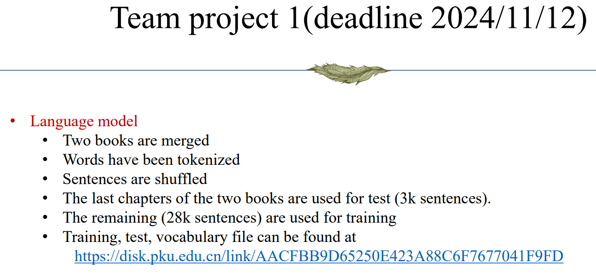
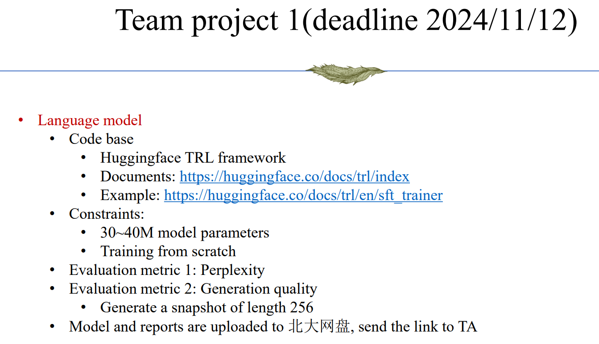
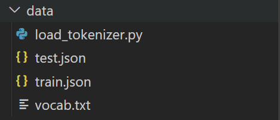

# Generative Models Project 1

## 组员
- 吴童
- 潘聿阳
- 丁俊喆

## Task

- [data](https://disk.pku.edu.cn/anyshare/zh-cn/link/AACFBB9D65250E423A88C6F7677041F9FD?_tb=none&expires_at=2025-01-25T20%3A04%3A19%2B08%3A00&item_type=folder&password_required=false&title=Generative%20Model%20Homework&type=anonymous)

## 环境配置
1. 将提供的北大网盘中文件夹重命名为data放在项目文件夹下

2. conda配置环境
'''sh
conda env create -f env.yaml
'''

